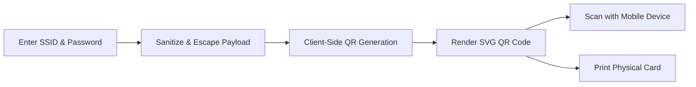

# WiFi QR Generator

A modern, lightweight, and offline-capable WiFi QR Code Generator.


---

## Overview

**WiFi QR Generator** is a web-based utility designed to convert WiFi network credentials into scannable QR codes quickly and securely. By providing a network name (SSID) and password, users can generate a standard WiFi configuration QR code that can be scanned by smartphones and mobile devices to join the network without manual credential entry.

The entire application runs directly in the client browser without external API dependencies, ensuring rapid rendering and complete credential privacy.

---

## Features

- **WiFi QR Code Generation**: Constructs standard WPA network configuration payloads (`WIFI:T:WPA;S:<SSID>;P:<PASSWORD>;;`) with proper escaping of reserved characters (`\`, `;`, `,`, `"`, `:`).
- **100% Client-Side & Offline Generation**: Generates QR codes locally using a bundled JavaScript QR library with no external network requests or third-party APIs.
- **Real-Time Live Updates**: QR code updates dynamically on user input with a micro-bounce feedback animation.
- **Neo-Brutalist Visual Design**: High-contrast aesthetic featuring bold borders, hard offset drop shadows, Space Grotesk typography, and an animated grid backdrop.
- **Visual Scanner Effect**: An overlaid animated scanning laser indicator over the QR preview.
- **Dedicated Print Stylesheet**: Includes print-specific CSS rules (`@media print`) and a "Print WiFi Card" action to format the card cleanly on physical paper, hiding UI buttons and interactive chrome.
- **Responsive Layout**: Fluidly scales across mobile viewports and desktop resolutions.
- **Validation Indicators**: Displays real-time guidance prompts when network credentials are empty or incomplete.

---

## Tech Stack

| Technology | Purpose |
| :--- | :--- |
| **HTML5** | Semantic structure, input forms, and accessibility tags |
| **CSS3** | Vanilla styling, CSS variables, keyframe animations, and media queries (`screen` and `print`) |
| **JavaScript (ES Modules)** | Dynamic DOM updates, event handling, string sanitization, and printing logic |
| **Vite (v5.x)** | Development server with Hot Module Replacement (HMR) and production bundling |
| **Standalone QR Engine** | Bundled client-side QR generator (`assets/qrcode.min.js`, based on Kazuhiko Arase's QR library) with SVG data URL output |

---

## How It Works



1. **Enter WiFi Name**: Input your network's SSID into the "Network name" field.
2. **Enter Password**: Enter the network password into the "Password" field.
3. **Instant Encoding**: The application formats the credentials into the standard WiFi connection protocol and generates an inline SVG QR code.
4. **Scan or Print**: Point a compatible smartphone camera at the generated QR code to connect instantly, or click "Print WiFi Card" to print a physical card.

---

## Getting Started

### Prerequisites

Ensure you have [Node.js](https://nodejs.org/) (version 18+ recommended) and `npm` installed on your machine.

### Installation

1. **Clone the repository**:

   ```bash
   git clone <repository-url>
   ```

2. **Navigate into the project directory**:

   ```bash
   cd "Wifi QR Generator"
   ```

3. **Install dependencies**:

   ```bash
   npm install
   ```

4. **Start the development server**:

   ```bash
   npm run dev
   ```

5. **Open in browser**:
   Open the local URL displayed in your terminal (typically `http://localhost:5173`).

---

## Build for Production

To create an optimized production build:

```bash
npm run build
```

The compiled static assets will be output to the `dist/` directory.

To preview the production build locally:

```bash
npm run preview
```

---

## Offline Support

The application does not rely on third-party QR generation APIs (e.g., Google Charts API or external image endpoints). QR codes are generated directly in the browser runtime via the bundled `assets/qrcode.min.js` file. Once the project assets are loaded, the application can function entirely without an active internet connection.

---

## Project Structure

```
Wifi QR Generator/
├── assets/
│   └── qrcode.min.js     # Bundled standalone QR code library
├── index.html            # Main application markup and entry point
├── package.json          # Project metadata, scripts, and dependencies
├── package-lock.json     # Dependency lockfile
├── script.js             # Application logic, input events, and QR rendering
├── style.css             # Neo-brutalist styling, animations, and print media rules
└── README.md             # Project documentation
```

---

## Usage

1. Open the application in your browser.
2. In the **Network name** field, type the exact name of your wireless network.
3. In the **Password** field, type your network password.
4. As you type, the QR code updates in real time.
5. Point a smartphone camera at the on-screen QR code to test connectivity.
6. Click **Print WiFi Card** to open the browser print dialog. The printed page will format the card neatly without web buttons or backgrounds.

---

## Browser Compatibility

Compatible with all modern web browsers supporting standard HTML5, CSS Grid/Flexbox, ES6+ JavaScript modules, and SVG Data URLs:

- Google Chrome
- Mozilla Firefox
- Microsoft Edge
- Apple Safari
- Modern mobile browsers (iOS Safari, Android Chrome)

---

## Privacy & Security

- **Zero Remote Storage**: All inputs are processed locally in browser memory.
- **No Telemetry or Tracking**: No network requests are made when entering passwords or generating QR codes.
- **Ephemeral State**: Network credentials are not persisted in `localStorage`, cookies, or remote databases. Refreshing or closing the tab clears the session state.

---

## License

No formal repository-level license has been designated for this project yet.

The bundled QR generation library located at `assets/qrcode.min.js` is based on the Kazuhiko Arase QR Code library (MIT / Public Domain).

---

## Credits

- **Design / Project Concept**: Referenced in project markup as `@coding.stella`.
- **QR Code Algorithm**: Kazuhiko Arase (`qrcode.min.js`).
